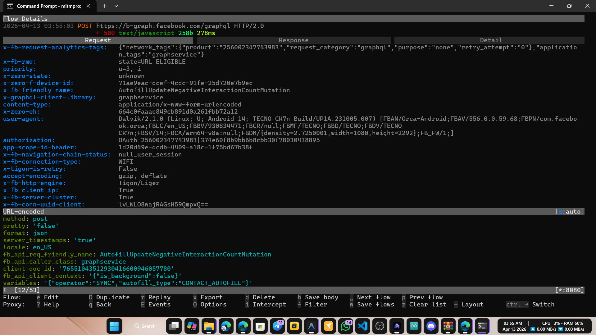

# 🔐 Messenger-SSL-Pinning-Bypass
📡 Intercept Messenger network traffic on Android device

## 📌 Latest Bypassed and Tested App Details
- App version: **556.0.0.59.68**
- Architecture: **arm64-v8a, armeabi-v7a, x86, x86_64**
- Tools Used for test: [Mitmproxy](https://mitmproxy.org/), [Burp Suite](https://portswigger.net/burp), [HTTP Toolkit](https://httptoolkit.com/), [Reqable](https://reqable.com/).
- For any inquiries, please contact me on Telegram [https://t.me/DarknessKing999](https://t.me/DarknessKing999)

## 🎥 Evidence



## ✅ Other Apps
1. [Messenger iOS](https://github.com/shajon-dev/iOS-Messenger-SSL-Pinning-Bypass)
2. [Facebook Android](https://github.com/shajon-dev/Facebook-SSL-Pinning-Bypass)
3. [Facebook iOS](https://github.com/shajon-dev/iOS-Facebook-SSL-Pinning-Bypass)
4. [Instagram Android](https://github.com/shajon-dev/Instagram-SSL-Pinning-Bypass)
5. [Instagram iOS](https://github.com/shajon-dev/iOS-Instagram-SSL-Pinning-Bypass)
6. [Threads Android](https://github.com/shajon-dev/Threads-SSL-Pinning-Bypass)
7. [Threads iOS](https://github.com/shajon-dev/iOS-Threads-SSL-Pinning-Bypass)
8. [Business Suite Android](https://github.com/shajon-dev/Meta-Business-Suit-SSL-Pinning-Bypass)

## 📦 For Demo - Download Official APKs
  - For any issues, contact me on Telegram. Read README.md carefully before use.
  - Please note that the latest version is a paid release and is not available for free download.
<table width="100%">
  <thead>
    <tr>
      <th rowspan="2" align="center">Package Name</th>
      <th rowspan="2" align="center">Version</th>
      <th rowspan="2" align="center">Status</th>
      <th rowspan="2" align="center">Working on Non root device</th>
      <th colspan="2" align="center">Download Link</th>
    </tr>
    <tr>
      <th align="center">arm64-v8a</th>
      <th align="center">x86_64</th>
    </tr>
  </thead>
  <tbody>
    <tr>
      <td rowspan="2" align="center"><code>com.facebook.orca</code></td>
      <td align="center">556.0.0.59.68</td>
      <td align="center">✅ Bypassed</td>
      <td align="center">Yes</td>
      <td colspan="2" align="center"><a href="https://t.me/DarknessKing999">Contact Telegram</a></td>
    </tr>
    <tr>
      <td align="center">500.1.0.71.108</td>
      <td align="center">✅ Bypassed</td>
      <td align="center">No</td>
      <td align="center"><a href="https://www.apkmirror.com/apk/facebook-2/messenger/facebook-messenger-500-1-0-71-108-release/facebook-messenger-500-1-0-71-108-30-android-apk-download/">Download Link</a></td>
      <td align="center"><a href="https://www.apkmirror.com/apk/facebook-2/messenger/facebook-messenger-500-1-0-71-108-release/facebook-messenger-500-1-0-71-108-11-android-apk-download/">Download Link</a></td>
    </tr>
  </tbody>
</table>

**📂 Free Patched `libcoldstart.so` files are available in the `libs/` folder**
**📜 Consolidated login scripts are available in the `login.sh` file**

## ☕ Buy Me a Coffee

If this project helped you, consider buying me a coffee! ❤️

| Coin | Network | Address |
| :--- | :--- | :--- |
| <table border="0" cellpadding="0" cellspacing="0"><tr><td></td><td>&nbsp;<b>Binance</b></td></tr></table> | Binance Pay (UID) | `839622149` |
| <table border="0" cellpadding="0" cellspacing="0"><tr><td></td><td>&nbsp;<b>USDT</b></td></tr></table> | TRC20 [TRX Network] | `TAsPdCxkX9CeErJ4vw7xBHfZDT6vpdfmwH` |
| <table border="0" cellpadding="0" cellspacing="0"><tr><td></td><td>&nbsp;<b>ANY Crypto</b></td></tr></table> | ETH / BSC | `0x22d4f314acbf6055b0a37df8df68f9cd40ba889a` |
| <table border="0" cellpadding="0" cellspacing="0"><tr><td></td><td>&nbsp;<b>BTC</b></td></tr></table> | Bitcoin Network | `14RYf4pw7v2rtttLxRch2StjFzFAn9ycCE` |

## 📱 Requirements
1. 🔓 Rooted Android phone or Emulator with root access (LDPlayer 9 / Nox Player)
2. 🛠️ ADB tools required for real devices only. Or use [MT Manager](https://mt2.cn/) to replace the .so file on the device.
3. 🔄 Tools for traffic capture: [Mitmproxy](https://mitmproxy.org/), [Burp Suite](https://portswigger.net/burp), [HTTP Toolkit](https://httptoolkit.com/), [Reqable](https://reqable.com/).

## 🔧 Setup Process
 1. 🔧 **Replace patched `libcoldstart.so`** with the original file at: `/data/data/com.facebook.orca/lib-compressed/libcoldstart.so`
 2. 📲 **Use ADB command** to push the patched library:
    ```
    adb push [YOUR_libcoldstart.so_PATH] /data/data/com.facebook.orca/lib-compressed/libcoldstart.so
    ```
 4. Use any packet capture tool to monitor Messenger network traffic.

## Looking for leatest version patched `libcoldstart.so`? Contact me on Telegram
<p align="left">
  <a href="https://t.me/DarknessKing999" target="_blank">
    
  </a>
</p>

## Need Solution for SSL Pinning Bypass?
- I provide SSL pinning bypass solutions for both Android and iOS applications.
If a bypass for a specific application is not available on my GitHub, please contact me on Telegram for support. I am active on Telegram most of the time.
